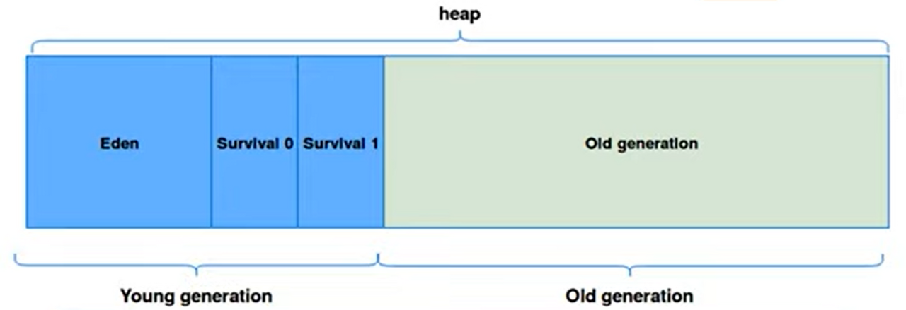

### JVM (Java Virtual Machine)

- 자바 프로그램 실행환경을 만들어 주는 소프트웨어
- JRE(Java Runtime Environment)에 포함되어있음
- OS에 종속적이지 않음 (플랫폼 독립적)
  - OS 달라지더라도 프로그램 코드에 변화 없이 실행 가능
- 자바 바이트 코드 (`.class` 파일)를 OS에 특화된 코드로 변환해서 실행시킴

구성요소

- 클래스 로더(Class Loader)?
  - 컴파일된 자바 바이트 코드를 메모리 영역에 로드
  - 계층 구조
    - 트리 형태
    - 클래스 로더끼리 부모 자식 관계
  - 위임 모델
    - 상위 클래스 로더에 존재시 해당 클래스 사용, 없을 경우 클래스 로드
- 실행 엔진(Execution Engine)
  - 자바 바이트코드를 실행
  - 명령어 실행 방식 **인터프리터 방식**과 **JIT 컴파일러 방식** 존재

JIT 컴파일러

- 인터프리터 방식으로 실행하다 적절한 시점에 바이트코드 전체를 네이티브 코드
- 이후 인터프리터는 네이티브 코드로 컴파일된 코드를 바로 사용
- JIT 컴파일러 컴파일하는 과정은 바이트코드 인터프리팅보다 훨씬 느림
- 적게 실행되는 코드라면 컴파일 없이 인터프리팅이 성능상 유리
- 따라서 해당 메소드의 수행빈도를 확인 후 일정 정도를 넘을시 컴파일 수행

### GC (Garbage Collection)

- reachability

  - 유효한 참조 여부에 따라 reachable/unreachable로 구별

- **참조되지않는 unreachable의 객체를 가비지로 간주**, **JVM의 가비지 컬렉터 불필요한 메모리 주기적으로 검사 →** 메모리 할당 해제

GC 실행 과정?

1. Stop The World
   - GC 실행 스레드 외 모든 스레드 작업 중지
   - GC 최소한으로 발생시켜야함
2. Mark and Sweep
   - Mark : 사용되고 있는 메모리 식별
   - Sweep : Mark되지 않은 객체 메모리에서 제거

JVM Heap 영역 2가지 전제로 설계 (Weak Generational Hypothesis)

- 대부분의 객체 금방 접근 불가능한 상태가 된다
- 오래된 객체에서 새로운 객체로의 참조는 아주 적게 존재한다

GC의 대상 메모리 (Heap 영역) = Young generation + Old generation

  

**Young generation**

**1개의 Eden 영역와 2개의 Survivor 영역**

Eden 영역

- 새롭게 생성된 객체 할당되는 영역
- 꽉 차면 Minor GC 발생 → 사용되지 않은 메모리 해제
- 살아남은 객체 Survivor 영역으로 이동
- 많은 객체 Young 영역에 생성되었다 사라짐

Survivor 영역

- 최소 1번의 GC 이상 살아남은 객체 존재 영역

Young generation영역에 대한 GC - **Minor GC**

**Old generation**

- Young generation에서 살아남은 객체 Old generation으로 복사
- **일반적으로 Young 영역보다 크기 크고 GC 오래 걸림**
- Minor GC만으로 확보한 메모리 공간이 부족할 때 Old generation에서 GC 발생

Old generation 영역에 대한 GC - **Major GC, Full GC**
