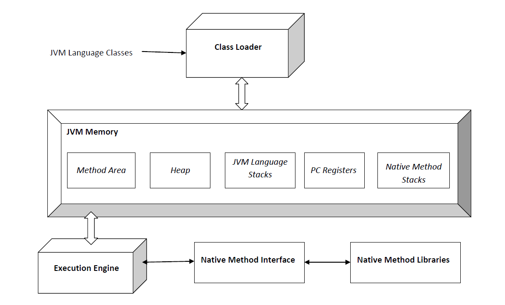

# JVM

## JVM의 정의

- `JVM `: 자바 가상 머신(영어: Java Virtual Machine, JVM)은 자바 바이트코드를 실행할 수 있는 주체이다.
- JVM의 목적은 바이트 코드를 기계어로 번역해서 CPU에게 일을 시키는 것이다. (이 핵심적인 일을 Interpreter가 수행하게 된다.)

## 자바 코드가 동작하기까지 과정

> 클래스 파일 안에 어떤 필드가, 어떤 메서드가 있는지, 바이트 코드 등을 포함해서 클래스에 대한 모든 정보가 들어있다. 바이트 코드란 JVM이 이해할 수 있는 명령어 집합을 의미한다.

- 자바 소스코드를 작성하고 컴파일을 하면 .class 파일(자바 바이트코드)이 생성된다.

- 자바 명령어로 바이트코드를 실행한다.

- JVM은 클래스 로더를 통해 클래스 파일을 읽어들인다. (클래스 로더는 클래스 파일 정보를 메모리에 올리고 검증하고, 스태틱 변수를 초기화하는 역할을 한다.)

- JVM은 Method 영역에 저장된 바이트 코드를 해석한다

## JVM 구조

  

자바 JVM의 구조는 위와 같다. 그중에 Execuation Engine에 Interpreter, JIT Compiler, Garbage Collector가 있으며, 위 JVM Memory라고 적혀있는 박스를 Runtime Data Areas라고 한다.

- `Method Area `: 클래스에 대한 정보가 저장되는 영역이다. 클래스에 대한 모든 정보가 이곳에 저장된다.

- `Heap` : 런타임에 생성되는 모든 객체들이 저장되는 영역이다. 가비지 컬렉터가 주로 이곳에서 동작한다.

- `JVM Stacks(JVM Language Stacks)` : 메서드를 실행하기 위한 정보들이 저장되는 공간이다. 프레임이라는 자료구조가 들어간다. 프레임은 메서드가 하나 호출될 때마다 새로 생기고, 메서드가 끝나거나 예외가 터지면 사라지게 된다.

- `PC Registers` : 현재 실행되고 있는 명령어의 주소를 저장하고 있는 곳이다. 멀티 쓰레드 환경에서 한 쓰레드가 작업을 하다가 다른 쓰레드로 잠시 CPU 점유를 넘겨주고, 다시 돌아왔을 때 이전에 어떤 명령어를 수행하고 있었는지 기억하고 있어야 이어서 작업을 수행할 수 있다.

- `Native Method Stacks` : C나 C++로 작성된 메서드를 실행할 때 사용하는 스택이다.

## Constant Pool

`Constatnt pool(Run-time Constant Pool)` :

- 클래스 내에서 사용하는 상수를 담은 테이블이다.
- 리터럴에 해당되는 값은 특정 메모리 공간인 Constatnt pool(Run-time Constant Pool)에 있다.
- 필요한 경우 Constatnt pool(Run-time Constant Pool)에서 가져와서 사용한다.
