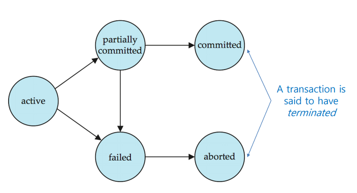

# 트랜잭션

## 데이터 무결성이란?

- `데이터 무결성`은 컴퓨팅 분야에서 완전한 수명 주기를 거치며 데이터의 정확성, 일관성을 유지하고 보증하는 것이다.

- `트랜잭션`은 데이터 무결성(integrity)을 보장해주는 핵심 개념이다.

## 트랜잭션(Transaction)이란?

- 트랜잭션은 데이터베이스 관리 시스템 또는 유사한 시스템에서 상호작용의 단위
- 여기서 유사한 시스템이란 트랜잭션이 성공과 실패가 분명하고 상호 독립적이며, 일관되고 믿을 수 있는 시스템을 의미한다.
- 트랜잭션은 아래의 연산을 포함한 원자성을 지닌 `논리적인 작업 단위(LUW, Logical Units of Work)`이다.
  - 하나 이상의 read 연산
  - 하나 이상의 write 연산
  - 트랜잭션 안에서의 데이터 계산 연산

여러 연산이 하나의 단위로 묶여있고, COMMIT으로 반영된다(원자성). 논리적 작업이라는 단어를 이해하기 위해서 계좌 이체라는 논리적 단위의 내부에 포함되어 있을 연산을 생각할 수 있다.

```sql
START TRANSACTION;
UPDATE table SET cost = cost + 1 WHERE id = 1;
UPDATE table SET cost = cost + 1 WHERE id = 2;
COMMIT;
```

트랜잭션의 연산으로는 `COMMIT`과 `ROLLBACK`이 있다.

- COMMIT은 "전부 성공? 오케이 반영"
- ROLLBACK은 "하나라도 실패? 응 반영 안 해, 모든 연산 전부 되돌려"이다.

## 트랜잭션의 상태

<p align ="center">
  
</p>

- `active`: 초기 상태이며 실행 중인 상태
- `partially committed`: 마지막 연산까지 실행하고, 반영하기 이전 상태
- `committed`: 트랜잭션이 성공적으로 종료한 상태며 영구적으로 데이터베이스에 반영
- `failed`: 트랜잭션의 오류가 생겨 중단된 상태
- `aborted`: 트랜잭션이 비정상적으로 종료되어 롤백된 상태

aborted 상태 이후에는 두 가지 선택지가 있다. 하나는 트랜잭션을 종료하는 것과 트랜잭션을 재실행하는 것이다. 만약 롤백의 원인이 트랜잭션 자체의 논리적인 오류인 경우 거나, 데이터가 없다면 종료된다. 만약 그렇지 않다면 트랜잭션이 재시작된다.

> 그림에서 partially committed에서 faild와의 간선은 연산이 끝난 이후 반영하기 이전 상태에서 발생하는 오류의 가능성을 의미한다.

## 트랜잭션의 특성 : ACID

트랜잭션은 4가지 특성을 가지고 있다.

### 원자성(Atomicity)

- 원자성을 쉽게 설명하자면 트랜잭션 안의 모든 연산은 모두 실행되거나 모두 실패한다. 그게 전부이다.

- 예를 들자면, 계좌이체라는 트랜잭션(논리적인 작업 단위) 내부에서 여러 연산이 있을 것이다.

  ```
  A.money = 6000, B.money = 3000
  A.money -= 3000
  B.money += 3000
  ```

- 처음에 A의 돈과 B의 돈은 각각 6000, 3000씩 존재한다 가정하자. 만약 A의 돈에서 마이너스 3000 연산을 수행하고 에러가 나서 다음 연산을 실행하지 못한다면 B는 돈이 늘어나지도 않았음에도 불구하고, A의 돈이 줄어든다.

- 즉, 초기에 돈의 총합과 논리적인 작업 단위가 수행(에러가 났지만 여하튼 수행했다.) 되고 나서의 돈의 총합이 다르다.

- 즉, 데이터베이스의 일관된 상태를 유지하지 못했다.

- 따라서 트랜잭션은 원자성을 보장하기 위해서 연산이 하나라도 실패할 경우 이미 실행된 연산들로 바뀐 부분을 다시 원복 시켜야 한다.

### 일관성(Consistency)

- 트랜잭션이 실행을 성공적으로 완료하면 언제나 일관성 있는 데이터베이스 상태로 유지하는 것을 의미한다.

- 무결성을 지키기 위해 모든 계좌는 잔고가 0 이하면 안된다는 무결성 제약조건이 있다면 이를 위반하는 트랜잭션은 중단되어야 한다.

- 예를 들어, A.money <= 0이라면 A.money에 마이너스를 하는 연산이 포함된 트랜잭션은 실패해야 한다.

위키백과와 데이터베이스 개론에서 일관성에 대한 정의는 같지만 예시는 다르다.
개론에서는 계좌 이체에서 값의 총합이 변하는 문제를 다루고, 위키에서는 트랜잭션에서 무결성 제약을 어기는 예제를 다룬다.

내가 생각한 바로는 계좌 이체의 예제에서는 `데이터 값의 일관`적임을 강조하고 무결성 제약의 예제는 `도메인의 일관성`을 강조하는 것 같다.

도메인의 일관성이란 위 예제에서 A.money의 도메인은 항상 양수로 일관적이다. 내가 위 원자성에서 계좌의 총합 예제를 넣은 이유는 원자성을 어길 경우 데이터베이스가 일관적이지 않은 상태가 생기므로 일관성도 같이 보장할 수 없는 상태가 되기 때문이다.

### 격리성(Isolation)

- 독립성이라고도 한다.

- 동시에 실행되는 여러 트랜잭션은 서로 독립적이다. 가장 엄격할 경우 순차적으로 실행한다.

- 트랜잭션을 수행할 때 다른 트랜잭션이 그 작업 사이에 끼어들지 못하도록 보장한다.

- 다시 말하자면 트랜잭션 밖에서 어떠한 연산도 중간 단계의 데이터를 볼 수 없음을 의미한다.

- 예를 들어, 계좌 이체 작업에서 A.money와 B.money의 총합이 10000인 상태로 시작했을 때, 어느 순간에는 총합이 10000이 아닌 경우가 있을 것이다. 하지만 다른 트랜잭션이나 연산에서는 항상 A.money와 B.money의 총합인 10000을 볼 수 있도록 보장되어야 한다.

### 지속성(Durability)

- 성공적으로 수행된 트랜잭션은 영원히 반영되어야 한다.
- 시스템이 장애가 나도 성공적으로 수행된 트랜잭션의 결과는 항상 데이터베이스에 반영되어 있어야 한다.
- 전형적으로 트랜잭션은 로그로 남고, 로그가 저장되어야 트랜잭션이 COMMIT 되었다고 간주한다.
- 나중에 장애가 발생한다면 로그 데이터를 통해 데이터베이스를 회복한다.

## 트랜잭션의 특성을 지원하는 DBMS

위와 같은 트랜잭션의 특성을 보장하기 위해서 DBMS는 여러 기능을 제공한다. 아래 표를 보자

| 트랜잭션의 특성 | DBMS의 기능    |
| --------------- | -------------- |
| 원자성          | 회복 기능      |
| 일관성          | 병행 제어 기능 |
| 격리성          | 병행 제어 기능 |
| 지속성          | 회복 기능      |
