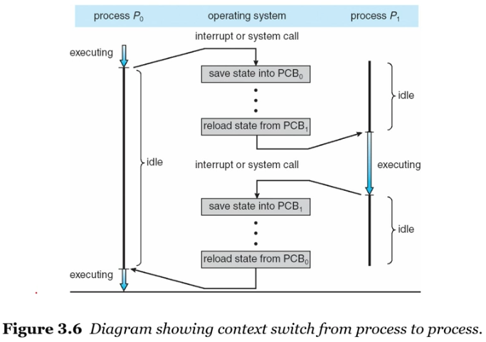
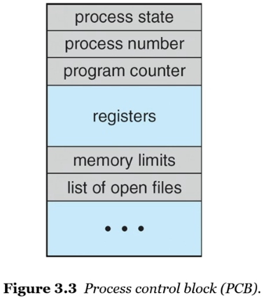

# 컨텍스트 스위치

## 컨텍스트 스위치란 무엇인가?

인터럽트는 운영체제가 CPU를 현재 작업에서 빼앗아 커널 루틴을 실행할 수 있게 한다.
종료 후 본래 작업 중이던 프로세스를 재개한다.

> 하지만 재개하려면 어떤 값을 저장해야하는지, 어느 곳에 저장해야하는지, 이 작업을 어떻게 칭해야하는지 정해야한다.

- 어떤 값을 저장 => 실행 중이던 프로세스의 문맥(Context)
- 어느 곳에 저장 => `PCB`
- 이 작업을 어떻게 칭하는지 => `컨텍스트 스위치`

프로세스 간 컨텍스트 스위치 Flow :

    

(1). 처음에는 0번 process가 cpu를 점유하여 executing 하고 있는 상태였다.

(2). 그런데 I/O interrupt인지 time expired인지 그런 원인에 의해 더이상 cpu를 점유할 수 없는 상태가 되었다.

(3). 그 즉시 0번 process의 정보를 담고 있는 0번 PCB에 상태가 저장 (save) 된다.

(4). 그리고 cpu에는 1번 process의 정보를 담고 있는 1번 PCB가 복원 (reload) 된다.

(5). 1번 process가 cpu를 점유했고, running 상태가 된다.

(6). 다시 2번과 같은 interrupt가 발생했고, 마찬가지로 1번 PCB에 정보가 저장된 후 0번 PCB가 다시 복원된다.

(7). 0번 process가 cpu를 점유하고 running 상태가 된다.

위 그림에서 컨텍스트 정보를 저장하고, 다른 프로세스로 교환하고 있는 상태를 컨텍스트 스위치라고 부른다.

**컨텍스트 스위치 더 알아보기 :**

- 문맥(Context)

  - CPU 레지스터의 값, 프로세스 상태, 메모리 관리 정보 등을 포함한다.

- 컨텍스트 스위치가 진행될 동안의 시스템
  - 그 동안 시스템은 아무런 유용한 일을 하지 못한다.
  - 컨텍스트 스위치 소요 시간은 순수한 오버헤드

## PCB란 무엇인가?

    

- `프로세스 상태` : New, Ready, Running, Waiting, Halted 등

- `프로그램 카운터` : 프로세스가 다음에 실행할 명령어의 주소

- `CPU 레지스터` : 누산기, 인덱스 레지스터, 스택 레지스터, 범용 레지스터, 상태 코드 정보 포함

- `메모리 관리 정보` : 기준 레지스터와 limit 레지스터의 값, 페이지 테이블, 세그먼트 테이블 등

- `CPU 스케줄링 정보` : 프로세스 우선 순위, 스케줄링 큐에 대한 포인터와 다른 매개변수들을 포함

- `사용한 파일과 입출력장치 목록` : 프로세스가 실행 과정에서 특정 입출력장치나 파일을 사용하면 PCB에 내용 명시
