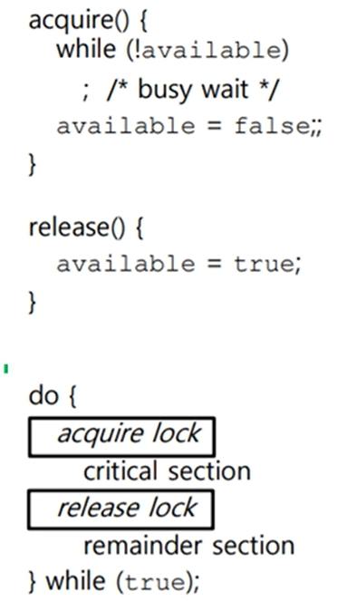
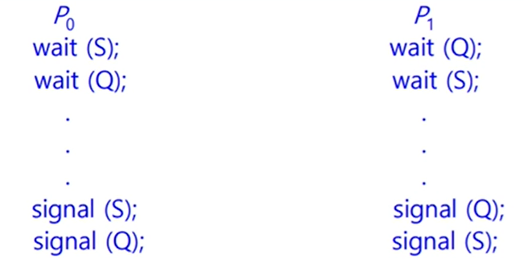

# 프로세스 동기화

> 동시다발적으로 실행되는 프로세스들은 공동의 목적을 올바르게 수행하기 위해 서로 협력하며 영향을 주고 받는다. 협력하여 실행되는 프로세스들은
> 실행 순서와 자원의 일관성을 보장하기 위해서 반드시 동기화 되어야 한다.

## 동기화란 무엇인가

> 프로세스뿐만 아니라 스레드도 동기화 대상이다. (실행의 흐름을 갖는 모든 것은 동기화 대상이다.)

`동기화`란 특정 자원에 접근할 때 한개의 프로세스만 접근하게 하거나, 프로세스를 올바른 순서대로 실행하게하는 것을 의미한다.

- **실행 순서 제어** : 프로세스를 올바른 순서대로 실행한다.
- **상호 배제** : 동시에 접근해서는 안 되는 자원에 하나의 프로세스만 접근하게 한다.

### 1. 실행 순서 제어를 위한 동기화 예시

- Reader 프로세스와 Writer 프로세스가 동시 실행 중인 상태
- 두 프로세스는 아무 순서로 실행되면 안됌 (Target 파일은 빈 파일이고, Reader 프로세스는 빈 파일을 읽지 않음)

### 2. 상호 배제를 위한 동기화 예시

> `상호 배제(mutual exclusion)`는 공유 불가능한 자원의 동시 사용을 피하기 위해 사용하는 알고리즘이다.

- 계좌에 10만원이 저축되어 있는 상태
- 프로세스 A는 계좌에 2만원을 입금하는 프로세스
- 프로세스 B는 계좌에 5만원을 입금하는 프로세스

```
 1. 프로세스 A가 잔액을 읽어옴
 2. 2만원 입금
 3. 문맥 교환
 4. 프로세스 B가 잔액을 읽어옴
 5. 5만원 입금
 6. 문맥 교환
 7. 프로세스 A에서 입금한 값 저장
 8. 프로세스 B에서 입금한 값 저장 => 15만원(갱신 분실)
```

한 프로세스가 잔액에 접근했다면, 다른 프로세스는 기다려야 한다. 상호 배제를 위한 동기화와 관련된 고전적인 문제로 `생산자-소비자 문제`가 있는데, 위 예시랑 비슷해서 생략한다.

하지만, 혹시 몰라서 첨부

- 버퍼에서 항목을 추가할때마다, 카운트값을 증가.
- 항목을 꺼낼때마다, 카운트값을 감소하는 매커니즘이 있다고 가정

> (1). 공유 메모리를 사용한 생산자 프로세스(생산될 때마다 count 증가)

```c
item next_produced;
while(true) {
  /*next_produced에 item 생산*/
  while(count==BUFFER_SIZE));
  /*아무일도 안함*/

  buffer[in]=next_produced;
  in = (in + 1) % BUFFER_SIZE;
  count++
}
```

> (2). 공유 메모리를 사용한 소비자 프로세스 (소비될 때마다 count 감소)

```c
item next_consumed;
while(true) {

  while(count==0);
  /*아무일도 안함*/

  next_consumed = buffer[out];
  out = (out + 1) % BUFFER_SIZE;
  count--;
  /*next_consumed에 있는 item 소비*/
}
```

- count 초기값을 5로 가정

- count++를 풀어서 표현하면
  ```
  register1 = count
  register1 = register1 + 1
  count = register1
  ```
- count--를 풀어서 표현하면
  ```
  register2 = count
  register2 = register - 1
  count = register2
  ```

count=5라고 표현되기까지의 과정(항상 아래처럼 실행되지 않는다.)

- T0 : 생산자가 register1 = count 수행 {register1 = 5}
- T1 : 생산자가 register1 = register1 + 1 수행 {register1 = 6}
- T2 : 소비자가 register2 = count 수행 {register = 5}
- T3 : 소비자가 register2 = register2 - 1 수행 {register2 = 4}
- T4 : 생산자가 count = register1 수행 {count=6}
- T5 : 소비자가 count = register2 수행 {count=4}

T4,T5의 순서가 바뀌거나, 지금 조차도 문제가 생긴다. 여러 프로세스가 동시에 동일한 데이터에 접근해서 조작하고, 그 결과가 언제, 먼저 접근하냐에따라 값이 달라지는 상황을 `경쟁상황`이라고 한다.

즉, 경쟁상황을 방지하기 위해서, 한 순간에 한 프로세스만 count를 조작할 수 있도록 보장해야함

## 공유 자원과 임계 구역

- 생산자 소비자 문제, 계좌 잔액 문제에서 잔액과 count를 `공유 자원` 이라고 함

- 공유 자원은 전역 변수, 파일, 입출력장치, 보조기억장치가 될 수 있다.

- 그 중 두 개 이상의 프로세스를 동시에 실행하면 문제가 발생하는 자원이 있다. 이러한 자원에 접근하는 코드 영역을 `임계 구역`이라고 한다.

- 두 개 이상의 프로세스가 임계 구역에 진입하고자 하면 둘 중 하나는 대기해야 한다. 임계 구역에 먼저 진입한 프로세스의 작업이 마무리되면 그제서야 기다렸던 프로세스가 임계 구역에 진입한다.

> 운영체제는 임계 구역 문제를 아래 세 가지 원칙으로 해결한다. (아래 원칙 지켜야함!)

- `상호 배제(mutual exclusion)` : 한 프로세스가 임계 구역에 진입했따면 다른 프로세스는 임계 구역에 들어올 수없다.
- `진행(progress)` : 임계 구역에 어던 프로세스도 진입하지 않았다면 임계 구역에 진입하고자 하는 프로세스는 들어갈 수 있어야 한다.
- `유한 대기(bounded waiting)` : 한 프로세스가 임계 구역에 진입하고 싶다면 그 프로세스는 언젠가는 임계 구역에 들어올 수 있어야 한다.

## 동기화 기법

### 1. 뮤텍스 락

<p align ="center">
    
</p>

- 동시에 접근해서는 안 되는 자원에 동시에 접근하지 않도록 만드는 도구 (상호 배제를 위한 동기화 도구)

- 임계 구역에 진입하는 프로세스는 자신이 임계 구역에 있음을 알리기 위해서 뮤텍스 락을 이용해 자물쇠를 걸어 둘 수 있다.

- 프로세스는 임계영역에 진입하기 전 반드시 락을 획득해야한다. 임계 영역 사용 종료 시 잠금 해제

- 잠금 사용 가능 여부를 나타내는 Boolean 변수 사용

- 그러나, Busy Waiting이 존재한다.(spinlock)

### 2. 세마포

> Mutex는 식당에서 1칸 짜리 화장실을 갈 때, 키를 받아서 간다. 사용 이후에는 키를 잠군다. 그 다음 사람은 그 키를 받아서 사용하고 뒤 사람에게 전달한다. 반면, 세마포어는 식당에서 3칸 짜리인 화장실을 간다. 그리고, 현재 사용자가 사용할 수 있는 화장실의 갯수를 전광판에 표시해준다. 프로세스가 자원을 방출할 때(사람이 나왔을때) 갯수가 증가한다.

세마포는 뮤텍스 락과 비슷하게 하나의 변수와 두개의 함수로 구현할 수 있다.

- 임계 구역에 진입할 수 있는 프로세스의 개수를 나타내느 `전역변수 S`
- 임계 구역에 들어가도 좋은지, 기다려야 할지를 알려주는 `wait 함수`
- 임계 구역 앞에서 기다리는 프로세스에 이제 가도 좋다고 신호를 주는 `signal 함수`

```c
wait(S){
    while(S <= 0) ; /*busy wait*/
    S--;
}

signal(S) {
    S++;
}
```

1. 만일 임계 구역에 진입 가능한 프로세스 개수가 0 이하라면
2. 사용할 수 있는 자원이 있는지 반복적으로 확인
3. 임계 구역에 진입할 수 있는 프로세스 개수가 하나 이상이면 S를 1 감소 시키고 임계 구역 진입
4. 임계 구역에서의 작업을 마친 뒤 S를 1 증가

#### 세마포 종류

- `카운팅 세마포` : 영역(domain)에 제한 없음(0과 1뿐만 아니라,2 ,3, 4 등의 값들 또한 가질 수 있다.), 유한한 개수를 가진 자원에 대한 접근을 제어하는 데 사용

- `이진 세마포` : 0과 1 사이 값만 가능. 뮤텍스락과 유사하게 동작, 몇몇 시스템에서는 뮤텍스라는 개념을 가져가지 않고 이진 세마포어를 가져감

#### 세마포 개선

세마포 역시, `busy waiting`이라는 단점이 존재한다. 따라서 다음과 같이 개선할 수 있다.

- wait 함수는 만일 사용할 수 있는 자원이 없는 경우, 프로세스 상태를 대기로 만들고, 프로세스의 PCB를 세마포를 위한 대기 큐에 넣는다.

- 다른 프로세스가 임계 구역에서의 작업이 끝나고 signal 함수를 호출하면, signal 함수는 대기 중인 프로세스를 대기 큐에서 제거하고, 프로세스 상태를 준비 상태로 변경한 뒤 준비 큐에 옮긴다.

```c
wait() {
    S--;
    if (S < 0) {
        add this process to Queue
        sleep();
    }
}

signal() {
    S++
    if (S <= 0) {
        remove a process p from Queue
        wakeup(p)
    }
}
```

1. 해당 프로세스 PCB를 대기 큐에 삽입한다.
2. 대기 상태로 접어든다.
3. 대기큐에 있는 프로세스 p를 제거한다.
4. 프로세스 p를 대기 상태에서 준비 상태로 만든다.

> 세마포의 변수 S를 0으로 두고, 먼저 실행할 프로세스 뒤에 signal 함수를, 다음 실행할 프로세스 앞에 wait 함수를 붙이면 프로세스의 실행 순서 제어도 가능하다.

## 교착 상태

> 두 프로세스와 1로 지정되어 있는 세마포 S,Q

<p align ="center">
    
</p>

- P₀이 wait(S)를 실행, P₁이 wait(Q)를 실행한다고 가정

- P₀이 wait(S)를 실행할 때, P₀은 P₁이 signal(Q)를 실행할 때까지 기다려야 함

- 마찬가지로, P₁이 wait(S)를 실행할 때는 P₀이 signal(S)를 실행할 때까지 기다려야 함

- 이들 시그널 연산들은 실행될 수 없기 때문에 P₀과 P₁은 교착상태가 된다.

### 교착 상태의 특징

> 교착상태는 자주 발생하지는 않는다. 한 시스템에 다음 네 가지 조건이 동시 성립 시 교착상태가 발생할 수 있다.

- 상호배제(Mutual exclusion)

  - 두 프로세스는 동시에 같은 자원에 접근할 수 없다.
  - 다른 프로세스가 그 자원을 요청하면, 요청프로세스는 자원이 해제 될 때까지 대기한 뒤 사용 가능하다.

- 점유하며 대기(Hold-and-wait)

  - 프로세스는 최소한 하나의 자원을 점유한 채, 현재 다른 프로세스에 의해 점유된 자원을 추가로 얻기 위해 반드시 대기해야 한다.

- 비선점(No preemption)

  - 자원들을 선점할 수 없어야 한다. (새치기 불가능)
  - 자원이 강제적으로 해제될 수 없고, 점유하고 있는 프로세스가 태스크를 종료한 후에만 해제된다.

- 순환 대기(circular wait)
  - 자원들이 cyclic하게 점유한 자원들을 대기해야 한다.

> 네 가지 요소 중에 하나만 끊어도 교착상태를 방지할 수 있다.

### 교착 상태 해결 방법

| 기법      | 설명                                                                                                            | 비고                                                                                                                                                             |
| --------- | --------------------------------------------------------------------------------------------------------------- | ---------------------------------------------------------------------------------------------------------------------------------------------------------------- |
| 무시      | deadlock 발생 확률이 낮은 시스템에서 아무런 조치도 취하지 않고 deadlock을 무시하는 방법                         | - 무시 기법은 시스템 성능 저하가 없다는 큰 장점이 있다. <br> - 현대 시스템에서는 deadlock이 잘 발생하지 않고, 해결 비용이 크기 때문에 무시 방법이 많이 사용된다. |
| 예방      | 교착 상태의 4가지 발생 조건중 하나가 성립하지 않게 하는 방법                                                    | - 순환 대기 조건이 성립하지 않도록 하는 것이 현실적으로 가능한 예방 기법입니다. <br> - 자원 사용의 효율성이 떨어지고 비용이 크다.                                |
| 회피      | thread가 앞으로 자원을 어떻게 요청할지에 대한 정보를 통해 순환 대기 상태가 발생하지 않도록 자원을 할당하는 방법 | - 자원 할당 그래프 알고리즘, 은행원 알고리즘 등을 사용하여 자원을 할당하여 deadlock을 회피한다.                                                                  |
| 탐지-회복 | 시스템 검사를 통해 deadlock 발생을 탐지하고, 이를 회복시키는 방법                                               | - 자원 사용의 효율성이 떨어지고 비용이 크다.                                                                                                                     |

## 꼬리 질문

> mutex와 semaphore 기법을 비교 설명해 주세요.

mutex는 오직 1개의 process/thread만이 공유 자원에 접근할 수 있고, semaphore는 세마포 변수의 값만큼의 process/thread들이 동시에 자원에 접근할 수 있습니다. mutex는 binary semaphore라고 할 수 있다.

> deadlock은 언제 발생하게 되나요?

deadlock은 상호 배제(mutual exclusion), 점유 대기(hold-and-wait), 비선점(no preemption), 순환 대기(circular wait)의 4가지 조건이 **동시에 성립**할 때 발생할 수 있다.

상호 배제는 동시에 한 thread만 자원을 점유할 수 있는 상황이고, 점유 대기는 thread가 자원을 보유한 상태에서 다른 thread가 보유한 자원을 추가적으로 기다리는 상황이다. 또 비선점은 다른 thread가 사용 중인 자원을 강제로 선점할 수 없는 상황을 뜻하고, 순환 대기는 대기 중인 thread들이 순환 형태로 자원을 대기하는 상황을 말한다.
