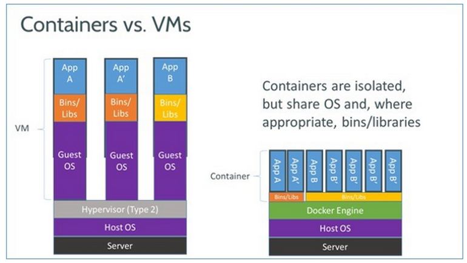

# 도커

## 1.도커란 무엇인가?

**1.1 정의**

Docker는 컨테이너 기술 기반의 오픈소스 가상화 플랫폼이다. 이미지와 같은 구성파일이 있기 때문에 공유, 재구축 및 배포하는것이 매우 쉬움

**1.2 컨테이너란?**

데스크탑, 기존의 IT 또는 클라우드 등 어디서나 실행될 수 있도록 애플리케이션 코드가 해당 라이브러리 및 종속 항목과 함께 패키징되어 있는 소프트웨어 실행 유닛이다.

**1.3 가상화란?**

가상화란 가상화를 관리하는 소프트웨어(주로 Hypervisor)를 사용하여 하나의 물리적 머신에서 가상 머신(VM)을 만드는 프로세스이다.

가상화의 핵심은 격리다. 논리적으로 격리가 제대로 이루어지면, 격리된 각각의 가상 시스템에서 문제가 생겨도, 다른 영역에 영향을 미치지 않는다.

오늘날 가상화는 크게 2가지 유형이 존재하는데,` 가상머신(vm)`과 `컨테이너(container)`이다.

#### 1.3.1 하이퍼바이저

<p align ="center">
    
</p>

vm을 만들기 위해서는 위 그림에서 보는 것처럼 물리적인 하드웨어를 논리적으로 가상화해야 한다. 이때 이를 담당하는 애가 바로 하이퍼바이저이다.

vm은 각각 독립적인 OS를 가지며, Application을 띄우고 Process를 올리는 것을 OS가 수행하고 관리한다. 따라서 일반적으로 운영체제를 supervisor라고 부른다. 위 그림에서 Guest OS가 supervisor 라면, 하이퍼바이저는 supervisor의 supervisor인 셈인 것이다.

#### 1.3.2 기존의 가상화 기술과 도커의 차이점

<p align ="center">
    
</p>

## 2. Docker 이미지 경량화 전략

이미지 크기 줄이는 전략이다. (push 나 pull 성능 빨라진다. 컨테이너 띄우는 속도, 보유할 수 있는 도커이미지 양 증가)

만약 이미지 용량이 증가하면, 이미지 빌드 시간, 레지스트리에 push 시간 증가, 이미지 pull 시간이 증가한다. 결과적으로 아래와 같은 문제가 발생한다.

- CI 소요 시간 증가
- 도커 이미지 저장 서버 용량 낭비
- CD 소요 시간 증가
- 자원 스케일 아웃시 투입 시간 증가

**2.1 꼭 필요한 패키지 및 파일만 추가**

- 하나의 프로세스를 실행하는거에 초점을 맞추는 기술이기 때문에, 필요 없는 패키지 파일을 모두 제거해야한다.

**2.2 컨테이너 레이어 수 줄이기**

- 도커 파일의 지시어 수를 줄이면 줄일 수록 레이어가 줄어 든다.
- 도커 파일 내에서 명령어를 실행하는 지시어 RUN => 하나의 RUN으로 만들어 레이어 수 줄이기

**2.3 경량 베이스 이미지 선택**

- 베이스 이미지 경량인 것으로 선택
- debian slim, alpine 계열, scratch(go lang, 보통 컴파일언어에서 사용) 등이 있음

**2.4 멀티 스테이지 빌드 사용**

- 빌드 스테이지와 릴리즈 스테이지를 나누어 빌드때 필요한 빌드 의존성은 빌드 스테이지에서 진행, 릴리즈 스테이지에서는 빌드 결과물만 복사해서 릴리즈 이미지의 용량을 경량화

멀티 스테이지 빌드는 컨테이너 이미지를 만들면서 빌드 등에는 필요하지만, 최종 컨테이너 이미지에는 필요 없는 환경을 제거할 수 있도록 단계를 나누어 기반 이미지를 만드는 방법이다.

<p align ="center">
    
</p>

멀티스테이지 빌드를 사용하게 되면 위의 그림처럼 컨테이너 실행 시에는 빌드에 사용한 파일 및 디렉토리과 같은 의존 파일들이 모두 삭제된 상태로 컨테이너가 실행되게 된다. 결론적으로 좀 더 가벼운 크기의 컨테이너를 사용할 수 있게 된다.

**2.5 Distroless 사용**

**빌드 파트**

```
FROM openjdk:11-jdk-slim-bullseye AS build-env
RUN apt update
RUN apt install -y git
RUN git clone https://github.com/GoogleContainerTools/distroless
WORKDIR /distroless/examples/java
RUN javac HelloJava.java
RUN jar cfe main.jar HelloJava HelloJava.clas
```

**실행 부분**

```
FROM gcr.io/distroless/java11-debian11
COPY --from=build-env /distroless/examples/java /distroless/examples/java
WORKDIR /distroless/examples/java
CMD ["main.jar"]
```

## 3. 도커 트러블 슈팅

**3.1 Docker Network 트래픽 Dump 방법 :**

- tcpdump 명령어 사용
- docker 컨테이너가 사용하고 있는 특정 네트워크 인터페이스를 확인(리눅스)
- 해당 인터페이스에서 발생하는 트래픽 정보(패킷)등을 tcpdump로 수집
- 수집한 트래픽은 파일로 dump

```sh
sudo tcpdump -i docker0 -w tcpdump.pcap
```

**3.2 Docker Network 트래픽 디버깅 방법 :**

- tcpdump로 수집된 트래픽의 dump파일을 로컬로 가져옴
- wireshark에 dump 파일 import
- wireshark를 통한 debugging 수행

## 4. CMD와 Entry Point의 차이점

- Entry Point는 항상 실행된다.
- CMD는 docker run 명령어를 실행할 때, 변경 가능하다.

- CMD 또는 ENTRYPOINT명령 중 하나 이상을 지정해야 한다.

- 컨테이너를 실행 파일로 사용할 때 정의해야 ENTRYPOINT로 지정 한다.

|                            | 엔트리포인트 없음          | ETRYPOINT exec_entry p1_entry  | ENTRYPOINT [“exec_entry”, “p1_entry”]          |
| -------------------------- | -------------------------- | ------------------------------ | ---------------------------------------------- |
| CMD 없음                   | error, not allowed         | /bin/sh -c exec_entry p1_entry | exec_entry p1_entry                            |
| CMD [“exec_cmd”, “p1_cmd”] | exec_cmd p1_cmd            | /bin/sh -c exec_entry p1_entry | exec_entry p1_entry exec_cmd p1_cmd            |
| CMD exec_cmd p1_cmd        | /bin/sh -c exec_cmd p1_cmd | /bin/sh -c exec_entry p1_entry | exec_entry p1_entry /bin/sh -c exec_cmd p1_cmd |
