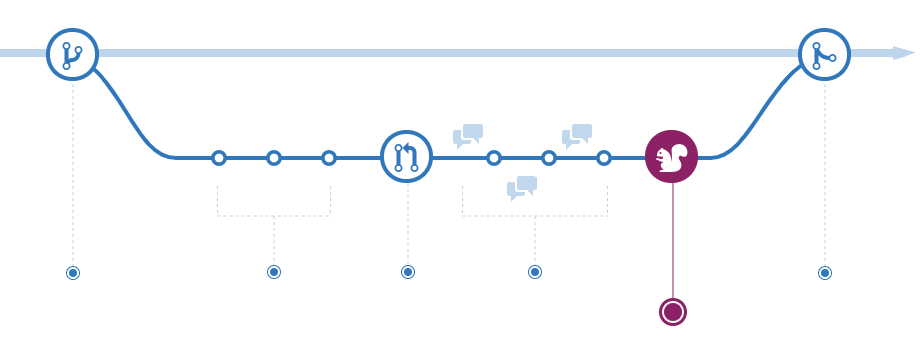

# git flow

## 1. git flow란?

> 브랜칭 전략이다.

Git-flow는 Git이 새롭게 활성화되기 시작하는 10년전 쯤에 `Vincent Driessen`이라는 사람의 블로그 글에 의해 널리 퍼지기 시작했고 현재는 Git으로 개발할 때 거의 표준과 같이 사용되는 전략이다.

### git-flow 특징

- Git-flow에는 5가지 종류의 브랜치가 존재한다.
- 항상 유지되는 메인 브랜치들(master, develop)
- 일정 기간 동안만 유지되는 보조 브랜치들(feature, release, hotfix)

### 브랜치 종류

- `master` : 제품으로 출시될 수 있는 브랜치
- `develop` : 다음 출시 버전을 개발하는 브랜치
- `feature` : 기능을 개발하는 브랜치
- `release` : 이번 출시 버전을 준비하는 브랜치
- `hotfix` : 출시 버전에서 발생한 버그를 수정 하는 브랜치

### 흐름으로 git-flow 알아보기

    

- 처음에는 master와 develop 브랜치가 존재. (물론 develop 브랜치는 master에서부터 시작된 브랜치이다. )

- develop 브랜치에서는 상시로 버그를 수정한 커밋들이 추가

- 새로운 기능 추가 작업이 있는 경우, develop 브랜치에서 feature
  브랜치를 생성

- feature 브랜치는 언제나 develop 브랜치에서부터 시작

- 기능 추가 작업이 완료되었다면 feature 브랜치는 develop 브랜치로 merge

- develop에 이번 버전에 포함되는 모든 기능이 merge 되었다면 QA를 하기 위해 develop 브랜치에서부터 release 브랜치를 생성

- QA를 진행하면서 발생한 버그들은 release 브랜치에 수정

- QA를 무사히 통과했다면 release 브랜치를 master와 develop 브랜치로 merge

- 마지막으로 출시된 master 브랜치에서 버전 태그를 추가.

## 정리

- Git flow 브랜치 전략은 여러 브랜치들이 존재하고 각 브랜치마다 상황이 명확하게 분류되어 있지만, 오히려 이렇게 많은 브랜치가 흐름을 더욱 복잡하게 만들기도 함
- 하지만 프로젝트의 규모가 커지면 커질수록 소스코드를 관리하기에 용이하다는 장점이 있다.

## 2. github flow란?

- github flow는 git flow의 브랜치 전략이 너무 복잡하고 적용하기 어렵다고 해서 생겨난 브랜치 전략이다.

- github flow는 master 브랜치 하나만을 가지고 진행하는 방식이다.

- master 브랜치는 어떤 기능이 구현되든, 오류가 수정되든 모두 master에 머지되어 항상 update된 상태를 유지한다.

### 흐름으로 github-flow 알아보기

    

- master 브랜치에서 개발이 시작된다.
- 기능 구현이나 버그가 발생하면 issue를 작성한다.

- 팀원들이 issue 해결을 위해 master 브랜치에서 생성한 feature/{구현기능} 브랜치에서 개발을 하고 commit log를 작성한다.

- push를 하면 pull request를 날릴 수 있다.

- pull request를 통해 팀원들 간의 피드백, 버그 찾는 과정이 진행된다. release 브랜치가 없으므로 이 과정이 탄탄하게 진행되어야 한다.

- 모든 리뷰가 이루어지면, merge하기 전에 배포를 통해 최종 테스트를 진행한다.

- 테스트까지 진행되면 master 브랜치에 머지한다.
