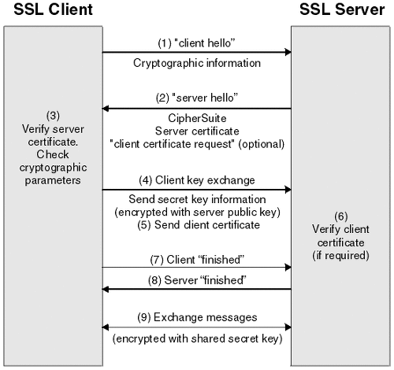

# http와 https

## http란 무엇인가

> HTTP는 웹 상에서 정보를 전송하기 위한 통신 프로토콜로 HTML과 같은 문서를 전송하는 것에 사용된다.

- http는 HyperText Transfer Protocol의 약자이다.
- 서버-클라이언트 모델을 따른다.
- request/response 구조로 웹 상에서 정보를 주고받을 수 있는 프로토콜이다.
- TCP/IP 기반으로 작동한다.
- Connectionless와 Stateless가 가장 큰 특징이다.

## 구조

클라이어트가 HTTP request를 서버에 보내면 서버는 HTTP response를 클라이언트에 보내는 구조이다.

- request message는 start line(method, path, http version), headers, body로 이루어져 있다.
- response message는 status line(HTTP version, status code, status message), headers, body로 이루어져 있다.

## Connectionless

HTTP는 서버에 연결 후 요청에 응답을 받으면 연결을 끊어버리는 Connectionless 특성을 갖는다. 이로 인해 많은 사람이 웹을 이용하더라도 실제 동시 접속을 최소화하여 더 많은 유저의 요청을 처리할 수 있다.

> HTTP 1.0은 connection이 non-persistent(connection 헤더 -> keep-alive), 1.1은 기본값이 persistent

## Stateless

연결을 끊기 때문에, 클라이언트의 이전 상태(로그인 유무 등)을 알 수 없다는 Stateless 특성이 생긴다.

## HTTP의 단점 보완

Connectionless, Stateless 특성을 가진 HTPP의 단점을 보완하기 위해서 cookie, session, jwt 등이 도입되었다.

또한, http는 정보를 text 형식으로 주고받기 때문에 중간에 인터펩트할 경우 데이터 유출이 발생할 수 있는 문제가 존재해, HTTP에 암호화를 추가한 프로토콜이 HTTPS이다.

## HTTPS 란

HTTP 프로토콜의 암호화된 버전이다. 클라이언트-서버 간의 모든 커뮤니케이션을 암호화하기 위해서 SSL이나 TLS를 사용한다. HTTPS를 사용하면 통신 내용이 공격자에게 공격받는 것을 방지할 수도 있고, 클라이언트는 접속하려는 서버가 신뢰할 수 있는 서버인지 판단할 수도 있다.

## SSL/TLS

SSL(Secure Scokets Layer)은 암호화 기반 인터넷 보안 프로토콜이다. 전달되는 모든 데이터를 암호화하고 특정한 유형의 사이버 공격도 차단한다. TLS는 SSL의 업데이트 버전이며 명칭만 다르다고 볼 수 있다.

- SSL 프로토콜은 SSL 인증서를 사용해 작동한다.
- SSL 인증서는 클라이언트와 서버간의 통신을 제 3자가 보증해주는 전자화된 문서다.
- 클라이언트가 서버에 접속하면 서버는 클라이언트에게 이 인증서 정보를 전달한다.
- 클라이언트는 먼저 이 인증서의 정보가 신뢰할 수 있는지 확인하고나서야, 작업을 수행한다.
- SSL 인증서에는 서비스의 정보(인증서를 발급한 CA, 서비스의 도메인 등)와 서버의 공개키가 포함되어 있다

> 제 3자인 CA(Certificate Authority, 공개키를 저장해주는 신뢰성이 검증된 민간 기업)에 의해 암호화된다. 이 때 공개키 암호화기법이 사용되는데, CA의 비공개키로 암호화가 진행된다. 이는 브라우저가 보유한 검증된 CA 공개키에 의해 복호화가 가능하다. (브라우저는 신뢰된 CA 기업의 공개키는 모두 보유, 따라서 바로 복호화가 가능.)

## HTTPS 동작 방식

<p align ="center">
    
</p>

- 초기 협상 단계

  - 클라이언트,서버 간에 Client Hello,Server Hello 메세지 교환
  - 클라이언트가 서버에게 Cipher Suite(사용 가능 암호화,해싱 방식 등)을 보내고
    서버 인증서를 요구

- 인증 단계

  - 서버에서 공개키,서버명,인증기관 주소 등을 포함한 인증서를 클라이언트에게 전송
  - 이때, 서버는 클라이언트가 제시한 것 중 자신이 선택한 암호화 방식 및 인증서를 보냄
  - 클라이언트는 서버 인증서의 유효성 확인

  - 보안 채널 형성

    - 클라이언트는 보안 채널 형성에 필요한 세션키를 만들기 위해,
    - 서버의 공개키를 이용하여 임의의 수(Pre Master Key)를 암호화시켜 서버에게 전송하고,
    - 서버는 자신의 비밀키(개인키)로 이를 해독(역암호화)하게 됨
    - 이때 임의의 수(Pre Master Key)로부터 Master Key를 유도하고,
    - 이 Master Key로부터 양측은 암호화,복호화에 필요한 세션키를 생성함

  - 상호 암호화 통신 시작
    - 즉, 보안성이 확립된 TLS 터널 내에서 상호 통신

## 동작 방식 정리

```
1. A라는 서버를 만드는 기업이 HTTPS를 적용하기 위해 공개키와 개인키를 만듬.

2. 신뢰할 수 있는 CA 기업에 공개키 관리를 부탁하며 계약을 맺음.

3. 계약이 완료된 CA 기업은 A 서버의 공개키, 해당 기업의 이름, 공개키 암호화 방법을 담은 인증서를 만들고 해당 인증서를 CA 기업의 개인키로 암호화해서 A 서버에게 제공.

4. A 서버는 직접적인 공개키가 아닌 암호화된 인증서를 보유

5. 클라이언트가 통신 요청을 보내면 앞선 SSL/TLS Handshake 과정을 수행하여 연결을 수립

6. 클라이언트와 A 서버와 통신을 시작
```

---

# 꼬리 질문

<details>
    <summary>꼬리, 멍청한 프록시 문제에 대해서 설명</summary>
    프록시가 connection 헤더를 이해하지 못하는 경우, 프록시는 connection 헤더를 그대로 웹 서버에 전송하고, 서버는 응답에 다시 connection을 실어서 보낸다. 그리고 프록시는 클라이언트에게 다시 보낸다. 서버는 프록시로부터 connection 요청과 응답을 주고 받았기 때문에 TCP 연결을 끊지 않는다.
    프록시는 서버가 TCP 연결을 끊을 떄까지 대기중인 상태이며, 이 상황에서 클라이어트가 다시 요청을 보내면, 프록시는 하나의 TCP 커넥션에 두 요청이 왔기 때문에 이를 무시한다. 즉, 서버로 2번째 요청이 가지 않는 상태이기 때문에
    클라이언트는 계속 무응답 상태의 화면만 보여줄 것이다. (타임아웃까지 지속)

    이 문제를 해결하기 위해서, proxy-connection 헤더가 존재한다. 영리한 프록시라면 이를 connection 헤더로 변경해 서버에 전달하며, 멍청한 프록시라면, proxy-connection을 서버에 그대로 보내고, 서버는 이를 무시하게 된다.

    하지만, 영리한 프록시 다음 프록시가 멍청한 프록시라면 connection 헤더를 웹 서버로 보내게 되고, 웹 서버는 connection 헤더를 멍청한 프록시로 보낸다. (다시 반복) 따라서 http 1.1은 keep-alive를 지원하지 않음 (connection : close)를 명시했을떄만 non-persist

</details>

<details>
  <summary> 꼬리, HTTP request method 중 GET과 POST를 비교 설명 </summary>

GET 메서드는 클라이언트가 서버에게 리소스를 요청할 때 사용하는 메서드이고, POST 메서드는 서버에게 데이터 처리(생성)를 요청할 때 사용하는 메서드다.

GET 요청의 경우 필요한 정보를 특정하기 위해서 URL 뒤에 Query String을 추가해 정보를 조회하며, POST 요청은 전달할 데이터를 Body에 포함하여 통신한다.

한 번 서버에 GET 요청을 한 적이 있다면 브라우저가 그 결과를 저장하며, 동일한 요청은 브라우저에 저장된 값으로 가져온다. (Query String도 저장)

반면, POST 요청의 경우 브라우저 히스토리에 남지 않고, 캐시도 불가능.

> 캐시란 한번 접근 후, 같은 요청할 시 빠르게 접근하기 위해 데이터를 저장시켜 놓는다.

> Query String은 URL 주소 끝에 key-value 쌍 파라미터

</details>

<details>
  <summary> 꼬리, put과 patch는 무슨 차이가 있나요? </summary>

PUT은 리소스의 모든 것을 업데이트 한다. 반면 PATCH는 리소스의 일부만 업데이트한다. 또한 요청한 URI에 자원이 존재하지 않다면, PUT은 새로운 자원을 생성한다. 반면 PATCH는 새로운 자원을 생성하지 않는다. 또한, PUT은 멱등성을 가지지만, PATCH는 멱등성을 가지지 않는다.

PUT은 리소스가 해당 데이터로 완전히 오버라이트한다. 따라서 동일한 요청을 여러번 보내더라도 항상 같은 데이터로 덮어씌워지기에 멱등성을 가진다.

반면 PATCH는 매 요청마다 특정 데이터를 증가시킬 수 있기 때문에 멱등성을 가지지 않는다.

</details>

<details>
  <summary> 꼬리, HTTP status code에 대해서 설명해주세요</summary>

HTTP status code는 클라이언트가 보낸 HTTP 요청에 대한 서버의 응답 코드이며, 상태 코드를 통해 요청의 성공/실패 여부를 판달할 수 있다. 100번 ~ 500번대까지 5개 클래스로 구분되어 HTTP 요청에 대한 상태를 알려준다.

</details>

<details>
  <summary> 꼬리, status code 클래스와 자주 등장하는 HTTP 응답 코드</summary>

- 1xx(정보) : 나 요청 받았고, 작업 계속할게
- 2xx(성공) : 요청한거 잘 이해했고, 성공적으로 처리했어
- 3xx(리다이렉션) : 요청한거 완료하려면 추가 작업이 필요해
- 4xx(클라이언트 오류) : 니 잘못
- 5xx(서버 오류) : 내 잘못
- 200 OK
- 201 Created
- 400 Bad Request
- 401 Unauthorized
- 403 Forbidden
- 404 Not Found
- 500 Bad Gateway

</details>

<details>
  <summary> 꼬리, www.google.com을 주소창에 쳤을 때 화면이 나오기까지의 과정을 설명</summary>

1. 사용자가 브라우저에 URL 입력
2. 브라우저는 DNS를 통해 서버의 IP 주소를 찾는다.
3. clent에서 HTTP request 메시지 -> TCP/IP 패킷 생성 -> 서버 전송
4. server에서 HTTP request에 대한 HTTP response 메시지 -> TCP/IP 패킷 생성 -> 클라이언트 전송
5. 도착한 HTTP response message는 웹 브라우저에 의해 렌더링

</details>

<details>
 <summary>
꼬리, 쿠키와 세션의 차이점을 말해주세요.
 </summary>

쿠키와 세션을 사용하는 이유는 HTTP의 connectionless, statless라는 특징 때문이다. 클라이언트가 요청했을 때, 그 요청에 맞는 응답을 보낸 후, 연결을 끊고 서버는 클라이언트에 대한 상태 정보를 유지하지 않기 때문에 알 수 없게 된다.

만약, 쿠키와 세션을 사용하지 않는다면 페이지를 이동할 때마다 계속 페이지에 로그인을 해야한다. 그리고 쿠키와 세션을 이용하면 로그인할 경우 아이디와 비밀번호 저장이나, 장바구니, 팝업 보지 않기 등과 같은 편의성을 제공 가능하다.

서버에서 response header에 set-cookie 속성을 사용해서 클라이언트에 쿠키를 만들고, 사용자가 따로 작업하지 않아도 브라우저가 쿠키를 request header에 담아서 서버에 전송한다. (cookie에는 key-value 쌍으로 클라이언트에 대한 정보를 브라우저의 쿠키 디렉터리에 저장)

반면 세션은 기본적으로 쿠키를 이용해서 구현한다. 클라이언트를 구분하기 위해 각 클라이언트에게 session ID를 부여하고, 클라이언트는 쿠키에 session ID를 저장해 둔다. 사용자 정보를 브라우저에 저장하는 쿠키와 달리 세션은 서버측에 저장해서 관리한다. 세션은 유효시간을 두어 일정 시간 응답이 없다면 끊을 수 있고, 브라우저가 종료될 때까지 인증상태를 유지할 수 있다. 사용자 정보를 서버에 두기 때문에 보안은 좋지만, 서버 자원을 차지함(성능 저하)

요약하자면, 쿠키는 클라이언트 로컹에 key-value 쌍으로 저장되는 데이터 파일이며, 유효시간 내에서는 브라우저가 종료되어도 계속 유지된다. 세션은 브라우저가 종료되거나, 서버에서 해당 세션을 삭제할 수 있기 때문에 쿠키보다 보안성이 좋다. 또한 서버에 데이터를 저장하므로 서버 용량이 허용하는 한에서 제한 없이 데이터를 저장할 수 있다는 장점이 있지만, 서버의 부하가 커진다는 단점이 될 수 있다.

</details>
